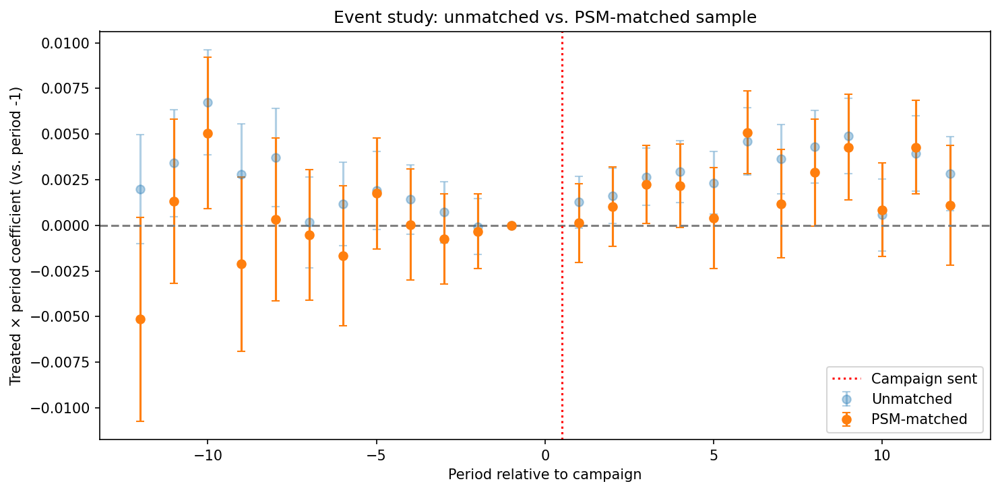

# Win-Back Email Incrementality: A Difference-in-Differences Case Study

## Business Question

An e-commerce company runs a win-back campaign: customers who haven't
purchased in 60+ days receive a re-engagement email. Targeting is not random —
a CRM rule selects recipients based on their recency, frequency, and monetary
(RFM) history.

The campaign reports well. Targeted customers converted at **10.2%** over the
following quarter, against **7.4%** for lapsed customers who weren't targeted —
a **2.88pp lift**, which the campaign takes credit for.

That number is inflated by **selection bias**. The CRM rule picks the customers
with the strongest RFM history, so recipients were always the likelier group to
convert. It also picks them at a low point in their own activity — that is what
"lapsed" means — so some fraction were drifting back on their own, email or no
email.

**So how much of that 2.88pp lift did the campaign actually cause, and what should the
marketing team do differently once they know?**


## Findings

**The reported 2.88pp lift is wrong in two ways. It overstates what the campaign
did — and it conceals that the effect comes from only part of the list.**

Between 12% and 31% of that lift is selection bias, not campaign effect. And all
of what survives comes from moderately-lapsed customers: the deeply-lapsed 30%
of the list produced nothing measurable.

| Method | Incremental Lift | SE | 95% CI |
|---|---|---|---|
| Naive comparison | 2.88pp | — | — |
| **PSM + DiD (headline)** | **2.54pp** | 0.68pp | [1.21, 3.87] |
| Regression Adjustment | 1.98pp | 0.28pp | [1.43, 2.52] |
| Shortened-window DiD | 2.59pp | 0.34pp | [1.92, 3.27] |
| **All three estimators consistent with** | **1.9 – 2.5pp** | | |

Every estimator agrees the incremental lift is positive and smaller than the
naive comparison suggests. How much smaller depends on which one you trust: the
DiD variants put selection bias at 10–12% of the reported lift, regression
adjustment at 31%. Either way, part of that 2.88pp reflects customers who were
coming back anyway, credited to an email that did not cause it.

No single estimate carries this conclusion. Credibility comes from
triangulation — using approaches leaning on different assumptions to check
against each other.

### The finding that should change what the team does

Splitting by lapse depth, using the PSM + DiD specification:

| Segment (based on recency) | Targeted | Incremental Lift | 95% CI | p |
|---|---|---|---|---|
| Moderate (60–119d) | 17,084 | **+4.14pp** | [2.51, 5.76] | <0.0001 |
| Deep (≥120d) | 7,432 | **−1.09pp** | [−3.38, 1.20] | 0.35 |

The entire measured effect sits in the moderate-lapse segment. Regression
adjustment reproduces the pattern (moderate +2.64pp, deep −0.12pp), so this is
no artifact of a single estimator, and the two segments were defined before
estimation, so it is no cut found by searching.

For deep-lapse customers, the naive comparison shows 6.19% converting against
5.79% of untargeted ones — a 0.40pp lift on the naive metric, and nothing at all
once you difference it out. Those customers were coming back on their own. The
email was billed for a return it did not cause.


## Method

### 1. Identification

Targeting was non-random, so comparing post-period levels confounds the email's
effect with who was selected to receive it.

The **treated** group is the 24,516 lapsed customers the CRM rule picked to
receive the win-back email. The **control** group is the 20,484 lapsed customers
it passed over. DiD gets around the level problem by comparing each group's
*change* instead of its level, differencing away any confounder that stays fixed
across the window.

That buys a different assumption in exchange: **parallel trends** — absent the
campaign, treated and control would have moved together.

**Parallel trends failed, and that failure determined the rest of the design.**
A placebo test on the pre-period returned a significant "effect" (−1.22pp,
p = 0.0008), and an event study with a joint F-test across all 11 pre-period
leads rejected parallel trends at p = 0.0002.

Why it failed follows directly from how targeting worked. Treated and control
customers sit at systematically different baseline RFM levels, which put them on
different purchase trajectories before the email was ever sent. That rules out
plain DiD on the raw groups and forces a weaker assumption —
**conditional parallel trends**: trends need only run parallel among customers
with comparable RFM. Matching on pre-period RFM is how the estimation below
makes that credible.

### 2. Estimation

Matching is what buys back the assumption that failed. If the trend break comes
from treated and control sitting at different RFM levels, then restricting the
comparison to customers at *comparable* RFM levels should remove it — and unlike
the original assumption, that is a claim the data can check.

Concretely: fit a logistic propensity model on RFM, match each treated customer
to their nearest control by propensity score (1-NN, 0.2 SD caliper, with
replacement), then run the DiD regression on the matched sample, weighting
reused controls by how often they were matched.

Matching cut RFM imbalance from **SMD ≈ 0.34 to ≈ 0.02** — comfortably inside
the 0.1 convention for balance, meaning the matched controls now look like the
treated group on every variable the CRM rule used. Every treated customer found
a match inside the caliper, so the estimate describes the whole targeted list,
and not just the subset that was easy to match.

**PSM + DiD estimate: 2.54pp** [1.21, 3.87], p = 0.0002.

**Its identifying assumption was tested, and it held.** After matching, the
placebo effect collapses from −1.22pp to 0.04pp (p = 0.95) — a fake treatment
assigned before the campaign now finds nothing, which is what a valid design
should produce. The event study says the same: the 11 pre-period leads no longer
drift, and the joint F-test that rejected before now cannot reject.



| sample | joint F-test | verdict |
|---|---|---|
| Unmatched | F(11) = 3.23, p = 0.0002 | reject parallel trends |
| PSM-matched | F(11) = 1.27, p = 0.24 | cannot reject parallel trends |

The pre-period deviation that disqualified plain DiD is gone once the comparison
is restricted to customers with comparable RFM.

#### Triangulation

Two further estimators test whether the result survives.

**Shortened-window DiD** re-tests the same assumption on friendlier data:
restrict the pre-period to weeks −7 onward, where the parallel-trends violation
was smallest, and rerun the identical specification. Estimate: **2.59pp**
[1.92, 3.27], and its own placebo comes back insignificant (−0.33pp, p = 0.15).
But it leans on parallel trends exactly as the headline does, so it was never
likely to disagree — a robustness check, not an independent one.

**Regression adjustment** drops the trend assumption altogether: regress the
post-period outcome on `treated` plus the RFM covariates, with no pre-period and
no time dimension. Estimate: **1.98pp** [1.43, 2.52]. This is the check that can
fail in a way the DiD variants cannot, because it rests on **unconfoundedness** —
that RFM captures everything driving both targeting and purchasing. Being
cross-sectional, it never looks at the pre-period, so a pre-trend problem cannot
contaminate it.

The two families break in different places. DiD handles unobserved
time-invariant confounders but needs a trend assumption; regression adjustment
needs no trend assumption but controls only for what was measured. For the answer
to be wrong, both would have to fail in the same direction at once. That they
land within 0.6pp of each other (2.54pp vs. 1.98pp) is what corroborates the
headline estimate.

Full diagnostics (covariate-balance tables, this event study, and placebo tests
at multiple cutoffs) are in `causal_analysis.ipynb`, sections 3–9.


## Limitations

Two assumptions carry this analysis. Conditional parallel trends survived every
test available here. Unconfoundedness is untestable in principle, and it is the
one to worry about.

- **The headline CI is wide — and still understated.** PSM + DiD's CI is
  [1.21, 3.87], nearly triple regression adjustment's width, because matching
  with replacement reuses 11,185 distinct controls to serve 24,516 treated
  customers: the effective sample is far smaller than the headline N. On top of
  that, PSM + DiD is a two-step estimator. The reported standard errors treat the
  matched sample as fixed, so they carry DiD's sampling uncertainty and none of
  the first stage's. The honest interval is wider than the one reported.
- **The identifying assumption is weaker, not absent.** Matching buys
  conditional parallel trends in place of the raw-group version that failed, but
  it still has to hold. The event study cannot reject it, and a test that fails
  to reject is not a test that proves.
- **Only RFM was observed, and this is the assumption most likely to be wrong.**
  Matching and regression adjustment can balance only what is in the data.
  Browse activity, tenure, and anything else that predicts purchasing but was
  never recorded would bias regression adjustment. DiD is partly protected here —
  it differences time-invariant covariates away whether they were measured or
  not — which is exactly why the two estimators are worth reading side by side.
- **Time-varying confounders escape both methods.** Differencing removes anything
  fixed across the window, but nothing that moved differently across the two
  groups during the campaign. A competitor promotion landing on high-value
  customers, or a seasonal swing that hits frequent buyers harder, would pass
  through untouched.

**What a randomized holdout would have given us.** All of the above is
second-best identification. Withholding the email from a random slice of the
eligible list would deliver the true effect with no parallel-trends assumption,
no unconfoundedness assumption, and no need for triangulation at all. Lewis &
Reiley (2014) and Gordon et al. (2018) both show observational estimators missing
experimental benchmarks even with rich covariates. The recommendations below
reflect that gap.


## Marketing Recommendations

*Cost assumption: sends are treated as costless.*

### What the campaign actually delivered

Across 24,516 emails, roughly **710 incremental conversions** — essentially all
of them from the moderate-lapse segment. Deep-lapse contributed nothing
measurable: its point estimate is negative but indistinguishable from zero, so it
is treated as zero here instead of subtracted. At zero cost, the campaign is
unambiguously worth running. **Keep it.**

### 1. Pull deep-lapse out of the standing win-back flow

**Stop treating the deeply-lapsed 30% of the list (7,432 customers) as a win-back
audience — it produced no detectable incremental conversions.** Those customers
were returning on their own. And every send to someone with no interest carries
unsubscribe risk, permanently closing a channel to a customer who might have
re-engaged later through a different one. **Keep a small holdout in the segment
so the decision stays measurable.**

### 2. Extend the campaign to moderate-lapse customers who were never targeted

**Send to the 16,719 moderately-lapsed customers the CRM rule skipped — worth
roughly 690 additional incremental conversions at the measured 4.14pp effect,
close to doubling what the campaign has produced, at zero incremental cost.**
Every one of them falls inside the propensity-score range of customers already
targeted, so this is interpolation from what was measured, not a bet on an
unfamiliar audience.

### 3. Run a holdout — the single highest-value next step

**Withhold the email from a random 10–20% of the newly-targeted moderate-lapse
group.** That yields an unbiased benchmark, costs nothing beyond forgone sends to
a small slice, and validates or corrects every estimate here.

It is also the only thing that can settle what this analysis cannot. The two
estimator families still differ by about 0.5pp (2.5pp vs. 2.0pp), and nothing in
the data adjudicates between them: parallel trends can be tested but never
confirmed, and unconfoundedness cannot be tested at all.


## Repo structure

```
.
├── causal_analysis.ipynb                     the full analysis
├── simulate.py                               the data-generating process
├── requirements.txt
└── README.md
```

`data/customers.csv` and `data/panel.csv` are not committed — they're fully
reproducible (seeded) via `simulate.py`.

## Data

The dataset is **simulated**, not real company data. The simulation targets
realistic RFM distributions and a non-random, recency/frequency/monetary-driven
targeting rule, so the selection-bias problem it produces is a genuine one rather
than an illustration of one. Conversion base rates are plausible assumptions and
shouldn't be quoted as industry benchmarks.

## References

- Card, D. & Krueger, A. (1994). *Minimum Wages and Employment: A Case
  Study of the Fast-Food Industry in New Jersey and Pennsylvania.*
- Farahat, A. & Bailey, M. (2012). *How Effective is Targeted Advertising?*
- Lewis, R. & Reiley, D. (2014). *Online Ads and Offline Sales.*
- Gordon, B., Zettelmeyer, F., Bhargava, N. & Chapsky, D. (2018). *A
  Comparison of Approaches to Advertising Measurement: Evidence from Big
  Field Experiments at Facebook.*
- Ellickson, P., Kar, W. & Reeder, J. (2022). *Estimating Marketing
  Component Effects: Double Machine Learning from Targeted Digital
  Promotions.*
- Rambachan, A. & Roth, J. (2023). *A More Credible Approach to Parallel
  Trends.*
- Ascarza, E. (2018). *Retention Futility: Targeting High-Risk Customers
  Might Be Ineffective.*
